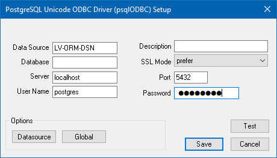
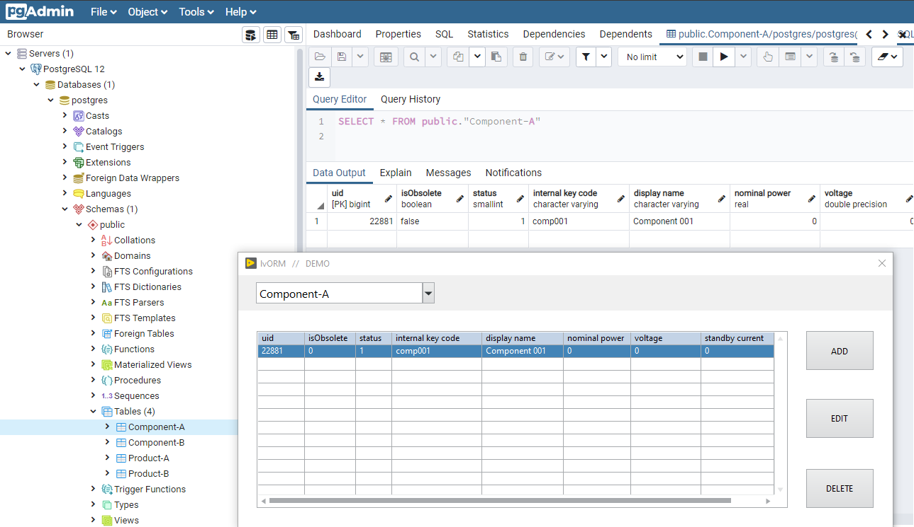

# LabVIEW ORM Library - version 1

LabVIEW ORM Library is a implementation that aims to provide LabVIEW developers with a simple tool capable of abstracting the SQL operations.
You can read about this project in my [LabVIEW OverEngineering Blog](https://medium.com/labview-overengineering).

This library uses PostgreSQL as database. Future versions of this tool may - or may not - provide the code needed to interface with other databases.

_____ 

#### THIS IS A DRAFT!
And most important, this is a Work In Progress. Things WILL break and I'm sure the final version will differ a lot from this first draft. Also, the first version of this library is just a Proof Of Concept.  Do not expect this to be supported or even to work with different data setups.

_____

## How to install? 

1. Download and Install [PostgreSQL](https://www.postgresql.org/download/windows/). It'll also instal pgAdmin - a Web Interface for managing postgresql servers and databases and StackBuilder.

2. Install Windows ODBC Drivers for PGSQL using StackBuilder, or Download it directly from [Software Catalogue](https://www.postgresql.org/download/products/2-drivers-and-interfaces/).
Check the bitness of the driver you will use: For LabVIEW 32bits, use the respective bitness ODBC driver - PostgreSQL ODBC for 32 bits. If unsure, install both 32 and 64 bits and the system will handle which driver to use ( mostly... )

3. Create or edit user and password if you want. 

	In my case, user and password is '**postgres**', the default username and password. For production, you may want to create another user. This is not our focus here, so [Read the Docs](https://www.postgresql.org/docs/) if interested.

4. Create an UDL File (create an text file and rename it to have a .UDL extension):

	a. Open the UDL file. 
	a. At the first tab, Provider, select ***Microsoft OLE DB Provider for ODBC Drivers***;
	b. At the second tab, Connection, follow the procedure:
	- Select `Use a Connection Chain`;
	- Click on `Create...`;
	- Select the `Machine Data Sources` tab;
	- Click on `New....`
	- You can choose to create the DSN either to your user or to all users of this machine.[^1] Select the desider option.
	- Now you'll choose the PostgreSQL Driver you installed in the second step. Select `PostgreSQL ODBC Driver(XXX)`and click `Next...`.
	- Configure the name you want to show and use when referencing to the DSN. For this example, we'll create a Data Source called LV-ORM-DSN.
	- You can also select the database you want to use or leave it blank and specify later. PostgreSQL's default database is named *postgres*. For now, we'll use this one.
	- Click `Save`.
	

	

5. If you want, explore your new database by opening pgAdmin4.

## How to use?

To run the supplied demo, open the LabVIEW Project ( version >= 2018 ).

1. Open the ***1- LV-ORM v1*** Project;
2. Open the ***main - demo lvORM.vi***;
3. Supply the UDL File you want to use via the `connection information` constant in the block diagram. If you're using your UDL file inside the project root, just replace the value in constant with `filename.udl`.
4. Run the VI.
5. If no errors appear, try to create your first object clicking in `Add...`
6. Save your object and navigate.
7. If you want to see your object stored into the database, open the pgAdmin.

_____

[^1]: Creating an user DataSource will prevent you to run the final executable with a different user than the one that configured the machine. For deployment, you probably should create a system-wide DSN. To create a system DSN, open the file with administrative privileges.  
